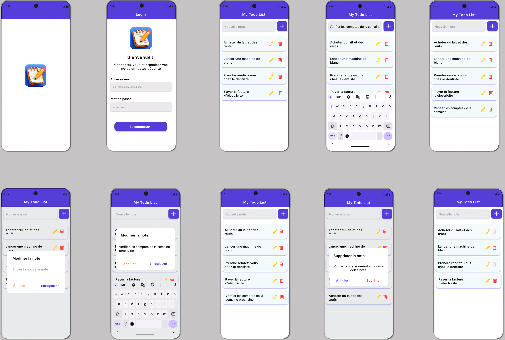

# DCLIC — Application de prise de notes (Flutter)

Application mobile de gestion de notes (type **Todo List**) développée avec **Flutter**. Elle intègre une **authentification sécurisée** et un **stockage local** robuste via **SQLite**.

> ### 🎯 Conformité à l’énoncé (Semaine 6)
> - Écran de **connexion** obligatoire (email + mot de passe).
> - Message d’erreur clair et précis en cas d’échec d’authentification.
> - Écran principal intuitif avec **liste des notes** existantes.
> - Gestion complète : ajout, **édition**, et **suppression** de notes.
> - Données persistées localement et de manière transparente grâce à **SQLite**.

---

## 🚀 Fonctionnalités & Ergonomie

### 1) Interface de connexion scrollable
- **Saisie sécurisée :** Champs dédiés pour l'adresse email et le mot de passe (masqué).
- **Protection anti-overflow :** L'ensemble du formulaire est enveloppé dans un `SingleChildScrollView`. Lorsque le clavier virtuel s'ouvre, l'interface glisse proprement vers le haut, éliminant tout crash visuel d'affichage (*Keyboard Overflow*).
- **Design soigné :** Les champs de saisie et le bouton bénéficient d'ombres colorées asymétriques orientées exclusivement vers la bordure basse (`BoxShadow` avec `Offset(0, 4)`) pour un effet de relief élégant et épuré.
- **Gestion déportée des erreurs :** Les messages de validation s'affichent nativement sous l'ombre des conteneurs, préservant la structure graphique et évitant de décaler le texte saisi à l'intérieur.
- **En cas d’échec :** Affichage d’un message explicite via une **SnackBar** rouge : *« Email ou mot de passe incorrect »*.

### 3) Écran principal : liste des notes
- **Affichage moderne :** Présentation des tâches sous forme de tuiles blanches épurées dotées, elles aussi, d'une ombre portée uniquement sur la bordure basse (`Offset(0, 4)`) pour se détacher proprement du fond de l'application.
- **Bouton d'ajout :** Un champ supérieur clair accompagné d'un bouton **`+`** indigo, facilement identifiable, pour l'insertion instantanée d'une nouvelle note.
- **Actions rapides :** Pour chaque note, l'utilisateur dispose d'une icône **crayon** (orange) pour modifier et d'une icône **poubelle** (rouge) pour supprimer.

### 4) Édition des notes
- Boîte de dialogue modale et ergonomique avec un champ pré-rempli.
- Boutons d'action clairs : **Annuler** (orange) / **Enregistrer** (indigo).
- Sauvegarde transparente en base locale SQLite avec rafraîchissement immédiat de la vue.

### 5) Suppression des notes
- Fenêtre de dialogue pour confirmation avant suppression définitive afin d'éviter les erreurs de manipulation.
- Boutons d'action : **Annuler** (indigo) / **Supprimer** (rouge).

### 6) Déconnexion sécurisée
- Icône *logout* placée de manière accessible dans la barre d'outils (`AppBar`).
- Utilisation de `Navigator.pushReplacement` pour détruire l'historique de la session et interdire tout retour involontaire vers la liste des tâches sans s'authentifier à nouveau.

## Wireframes


---

## 💾 Base de données (SQLite)

Le stockage est géré localement dans un fichier persistant :
- `todo_list.db`

### Tables

#### `users`
- `id` : INTEGER (PK auto-incrément)
- `email` : TEXT
- `password` : TEXT

> **Sécurité au démarrage :** Au tout premier lancement de l'application (bloc `onCreate`), un utilisateur administrateur unique est injecté en base via le modèle `User.admin()`. L'utilisation de la règle `ConflictAlgorithm.ignore` garantit qu'aucun doublon ni conflit ne sera créé lors des démarrages ultérieurs.

#### `todo_list`
- `id` : INTEGER (PK auto-incrément)
- `tache` : TEXT

### Opérations CRUD implantées
- `loginUser(email, password)` : Vérification des identifiants et conversion automatique de la ligne SQL via le constructeur `User.fromMap`.
- `insertTache(todo)` : Insertion d'une nouvelle tâche.
- `getAllTaches()` : Récupération de l'ensemble des tâches pour génération de la liste.
- `updateTache(todo)` : Mise à jour d'une tâche modifiée.
- `deleteTache(id)` : Suppression définitive d'un élément.

---

## 📁 Organisation du projet

Le code source respecte une architecture modulaire et découplée :

```text
lib/
│
├── database/
│   └── database_manager.dart   # Initialisation de SQLite (Batch, Tables, Seed Admin)
│
├── model/
│   ├── user.dart               # Modèle Utilisateur (Mapping Map/Object & Admin Factory)
│   └── todo_list.dart          # Modèle Note/Tâche (Mapping SQLite et Auto-incrément)
│
└── views/
    ├── login_inteface.dart     # Interface de connexion scrollable avec ombres et erreurs déportées
    └── todo_list_interface.dart# Écran principal CRUD (Liste avec ombres basses, Modals et Logout)
```

---

## ⚙️ Installation et lancement (dev)

### Prérequis
- Flutter SDK installé (version stable)
- Un émulateur Android/iOS **ou** un appareil physique connecté
- (Optionnel mais recommandé) Android Studio / Xcode configurés pour le build Flutter

### Installation depuis GitHub
1. Récupérer le projet :
    ```bash
    git clone https://github.com/Rachad-ac/projet_final_dclic.git
    cd app_to_do_list
    ```
2. Vérifier l’environnement Flutter :
    ```bash
    flutter doctor
    ```
3. Installer les dépendances :
    ```bash
    flutter pub get
    ```

### Lancer l’application en local (dev)
1. Lister les appareils disponibles :
    ```bash
    flutter devices
    ```
2. Démarrer l’app sur l’appareil voulu :
    ```bash
    flutter run
    ```
   (optionnel) Forcer un device id :
   ```bash
   flutter run -d <DEVICE_ID>
   ```
3. En cas de souci, consulter la console terminal (logs) :
   - erreurs de compilation Dart/Flutter
   - erreurs liées aux permissions (sur émulateur/appareil)

---

## 📱 Utilisation (Parcours Utilisateur)

1. **Ouverture :** L'application affiche le `Splash` pendant le demarrage de l'app et pendant que la base de données s'éveille.
2. **Authentification :** Renseigner l'email et le mot de passe.
   - *Identifiants par défaut :* 
     - Adresse mail : `admin@gmail.com`
     - Mot de passe : `password1234`
3. **Contrôle d'accès :** En cas d'erreur, une SnackBar explicite apparaît. Si les identifiants sont corrects, l'accès est déverrouillé et l'écran de login est détruit de la mémoire.
4. **Gestion au quotidien :**
   - Ajouter une note via le champ supérieur et le bouton **+**.
   - Modifier le contenu d'une note en cliquant sur le **crayon**.
   - Retirer une note de la liste en cliquant sur la **poubelle**.
5. **Fermeture :** Se déconnecter proprement via l'icône de déconnexion dans la barre supérieure.


---

## 🎨 Wireframing / UI

L'application a été conçue en plaçant l'expérience utilisateur (UX) au centre du développement :
- Un écran de login aéré, parfaitement adapté aux petits comme aux grands écrans grâce au défilement préventif.
- Une liste de notes hautement lisible grâce aux cartes blanches sur fond gris clair contrasté.
- Des fenêtres de confirmation (*Modals*) pour sécuriser les actions critiques d'édition ou de suppression.
- Une palette de couleurs harmonieuse et moderne (Indigo dominant avec des touches d'Ambre et de Rouge pour les actions).

> 📁 Les maquettes et les wireframes originaux ayant servi de référence pour l'intégration visuelle sont disponibles dans le dossier : `/assets/wireframes/`.
- Lien figma : https://www.figma.com/design/MilySsiE6xFTPqEjWrFNWw/gestion-de-notes?node-id=0-1&t=lDmpOTpUWM2shM5H-1


---

## 💳 Crédits
Projet de fin de formation de la **Semaine 6** réalisé dans le cadre de la **formation devellopemment mobile (flutter) - niveau intermediaire - DCLIC « Formez-vous au numérique avec l’OIF »**.
